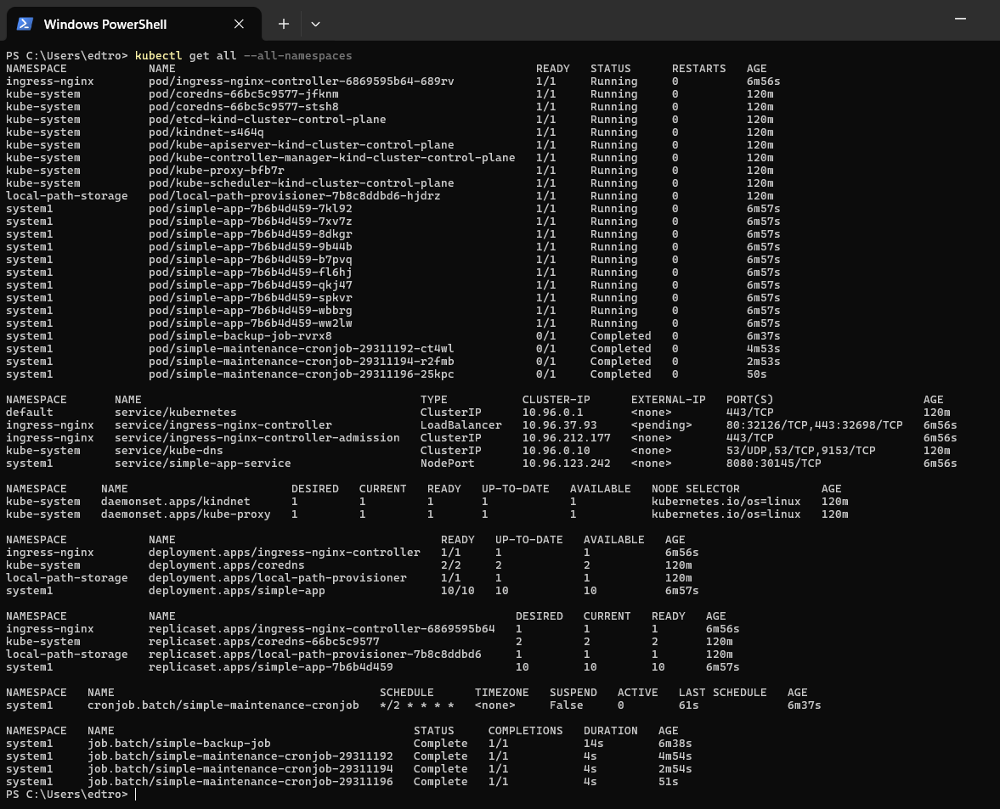
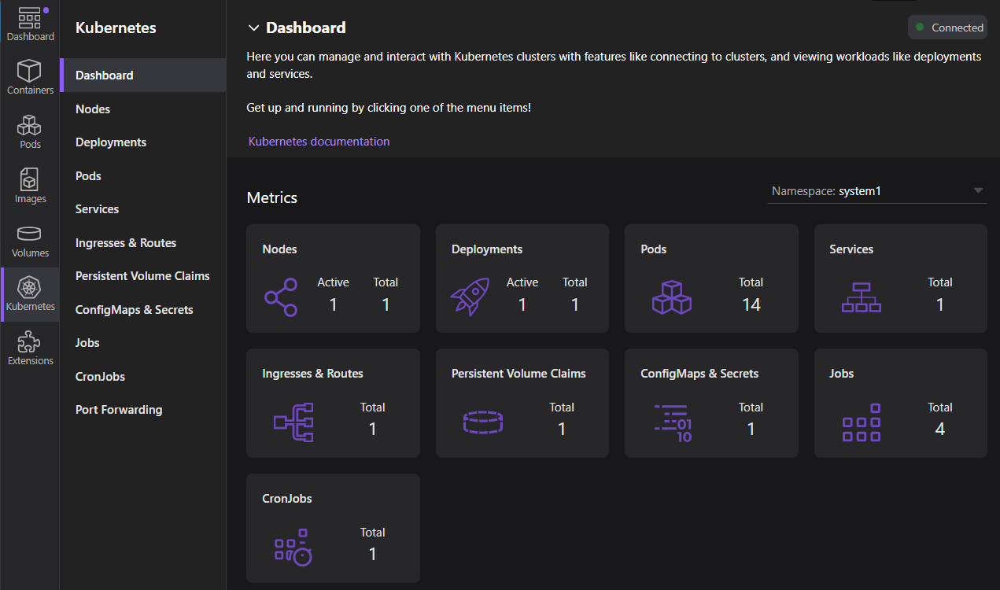

# Podman Desktop - Kind cluster accessible from WSL2
1. Create a Kind cluster in Podman Desktop (ensure it's running)
2. To access the Kind cluster from WSL2 follow the steps below

### Method 1: Using Kind export kubeconfig and copying to WSL2

- 1. Export kubeconfig in Windows/PowerShell (where your kind cluster is running)
```bash
# In PowerShell, run to saves config in C:\Users\<user>\.kube\config
kind export kubeconfig --name ClusterName --kubeconfig C:\Users\YourUserName\.kube\config
```

- 2. Copy kubeconfig to WSL2
```bash
mkdir -p ~/.kube
cp /mnt/c/Users/YourUserName/.kube/config ~/.kube/config
```

### Method 2: Directly use Windows kubeconfig in WSL2
```bash
export KUBECONFIG=/mnt/c/Users/YourUserName/.kube/config
```

### Check Kind cluster in WSL2
```bash
kubectl get nodes
kubectl get pods -A
kubectl get all --all-namespaces
```

## Useful kubectl commands to manage contexts and clusters
```bash
# List all contexts to see available clusters. The current context is marked with an asterisk (*)
kubectl config get-contexts

# Show the current context (cluster) in use
kubectl config current-context

# Switch to a different context (cluster) by specifying its name
kubectl config use-context <context-name>

# Display the entire kubeconfig file, which includes all contexts, clusters, and user information
kubectl config view

# Show information about the current cluster, including the API server address
kubectl cluster-info
```


# Deploy objects in WSL2 Kind cluster

### Deploy all objects
```bash
cd kind/scripts
./k8s-objects-setup.sh
```

### Check status of all objects
```bash
cd kind/scripts
./k8s-objects-status.sh

# or run kubectl command
kubectl get all --all-namespaces
```

### Access application
```bash
curl http://localhost:9090

# or open in your browser -> http://localhost:9090
```

### After apply objects, you can check the status of all objects in Podman Desktop UI and Windows PowerShell
- PowerShell
```bash
kubectl get all --all-namespaces
```


- Podman Desktop UI


### Cleanup/Delete all objects
```bash
cd kind/scripts
./k8s-objects-cleanup.sh
```
